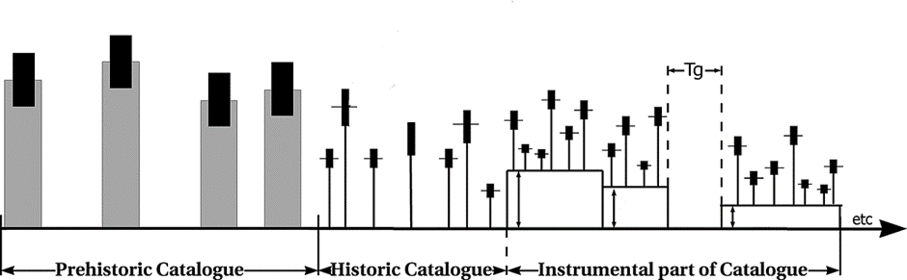

# Ha3Py

Hy3Py is the Python package for
estimation of Earthquake Hazard Parameters from Incomplete Data Files.
The typical parameters include the mean activity rate,
the b-value of the Gutenberg-Richter frequency-magnitude distribution,
and the maximum possible earthquake magnitude, for a given area.
Additional parameters can be evaluated when an alternative seismic magnitude occurrence model
or a different magnitude distribution is defined.
Hy3Py can incorporate any quality of catalogue, including paleo-earthquakes, historical records,
and instrumental data, even if the catalogue has significant incompleteness.

The prehistoric catalogue (or paleo-catalogue) contains earthquake records derived from geological investigations,
a process fraught with significant challenges and uncertainties.
The timing of these events is often ambiguous, and the catalogue is markedly incomplete.
The paleo-catalogue primarily comprises very strong earthquakes that appeared at the surface.
The historical catalogue includes events gathered from written sources.
This catalogue is characterised by a reasonably well-established timeframe for earthquake occurrence,
but exhibits poor magnitude determination.
It remains incomplete, encompassing only the most notable events.
The instrumental catalogues may include several sub-catalogues with different levels of completeness.

The Ha3Py code is written in Python and adopts an object-oriented approach.
The estimation algorithm operates on abstract magnitude probability classes.
It provides a highly flexible structure that enables
the assessment of multiple probability distributions in various combinations.
The library contains predefined classes for magnitude distributions,
such as the double-truncated Gutenberg-Richter distribution,
and classes for earthquake distribution probabilities, including the Poisson distribution.

The main programme of the package is called *ha3*.
This programme manages everything necessary for seismic hazard estimation.
It defines computation coefficients, assesses earthquake recurrence parameters,
and visualises the results.
Its queries and outcomes are analogous to those of the *HA3* programme written in MATLAB.
Additionally, *ha3* generates the configuration file for other programmes.
However, both *ha3* and the *configuration* programmes do not provide all configuration options
and cannot define external classes. Utilising all the features of the package requires the manual definition of the configuration file.

## Ha3Py installation

Ha3Py requires at least Python 3.9. All the required dependencies
will be downloaded and installed during the setup process.

### Installing the latest release
The latest release of Ha3Py is available on the `Python Package
You can install it easily through pip:

` pip install ha3py`

To upgrade from a previously installed version:

` pip install --upgrade ha3py`

### Installing a developer package

If you want to modify the source code, you should clone the project using git:

` git clone https://github.com/JanWiszniowski/ha3py.git`

Next, go into the ha3py main directory and install the code in editable mode by running:

` pip install -e`.

## Manual

Ha3Py manual *ha3py.pdf* is avaible at https://github.com/JanWiszniowski/ha3py

## Licence

GNU Lesser General Public License v3 (LGPLv3)

