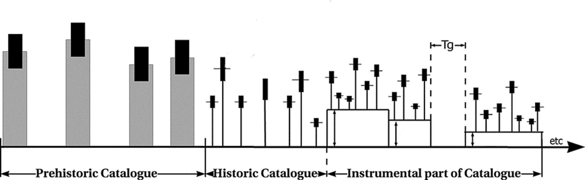

.. _general:

############
Introduction
############

Hy3Py is the Python package for assessing earthquake recurrence parameters.
The typical parameters include the mean activity rate :math:`\lambda`,
the b-value or :math:`\beta`-value of the Gutenberg-Richter frequency-magnitude distribution,
and the maximum possible earthquake magnitude, :math:`m_{max}`, for a given area.
Additional parameters can be evaluated when an alternative seismic magnitude occurrence model
or a different magnitude distribution is defined.
HyPy can incorporate any quality of catalogue, including paleo-earthquakes, historical records,
and instrumental data, even if the catalogue has significant incompleteness.
:numref:`(Fig. %s) <fig_g1>` illustrates the data that can be used to determine the required recurrence parameters.

.. _fig_g1:

    Illustration of typical data used for assessment of model recurrence parameters based on
    prehistoric, historic, and instrumental datasets (after :cite:t:`Kijko_atal_2016`)

The prehistoric catalogue (or paleo-catalogue) contains earthquake records derived from geological investigations,
a process fraught with significant challenges and uncertainties.
The timing of these events is often ambiguous, and the catalogue is markedly incomplete.
The paleo-catalogue primarily comprises very strong earthquakes that appeared at the surface.

The historical catalogue includes events gathered from written sources.
This catalogue is characterised by a reasonably well-established timeframe for earthquake occurrence,
but exhibits poor magnitude determination.
It remains incomplete, encompassing only the most notable events.

The instrumental catalogues may include several sub-catalogues with different levels of completeness.
The time gaps (Tg in :numref:`Fig. %s <fig_g1>`) represent missing event records.

The Ha3Py code is written in Python and adopts an object-oriented approach (see `OOD`_ and `OOP`_) to this issue.
The estimation algorithm operates on abstract magnitude probability classes.
It provides a highly flexible structure,
enabling the assessment of multiple probability distributions in various combinations.
The library contains predefined classes for magnitude distributions,
such as the double-truncated Gutenberg-Richter distribution,
and classes for earthquake distribution probabilities, including the Poisson distribution.
Refer to the section on the :ref:`Ha3Py Operation Diagram <description>`
for more information on how the code works.

The Ha3Py requires a working Python environment and the same Python packages to run
(see :ref:`Installation <installation>`).

The key programme of the package is called `ha3`.
This programme manages everything necessary for seismic hazard estimation.
It defines computation coefficients, assesses earthquake recurrence parameters,
and visualises the results.
Its queries and outcomes are analogous to those of the HA3 programme written in MATLAB.
Additionally, `ha3` generates the :ref:`configuration file <configuration>` for other programmes.
However, both `ha3` and the `configuration` programme do not provide all configuration options
and lack the ability to define external classes.
Utilising all the features of the package requires the manual definition of the configuration file.
All programmes, as command-line tools, are detailed in the :ref:`Command line tools <running>` section.
Besides executing the command line tool, it is also possible to build your hazard evaluation programme
using predefined classes and methods.
All Ha3Py methods and classes are outlined in the :ref:`Methods and Classes <api_methods>` sections.

The seismic hazard assessment conducted by the Ha3Py algorithm employs a hybrid approach.
The maximum magnitude :math:`m_{max}` is estimated separately using various methods,
while other parameters of the magnitude exceed probability,
such as :math:`\beta` (the equivalent of the b-value in Gutenberg-Richter (G-R) magnitude distribution)
and the :math:`\lambda` coefficient of the Poisson events occurrence probability,
are estimated independently through maximisation likelihood methods.
Nevertheless, the estimation error for all parameters is ascertained using the maximum likelihood method.

The main programme in the package is called `ha3`.
This programme handles all aspects necessary for seismic hazard estimation.
It defines computation coefficients, evaluates earthquake recurrence parameters, and visualises the results.
Its queries and outputs are similar to those of the `HA3` programme written in MATLAB.
Additionally, `ha3` generates the :ref:`configuration file <configuration>` for other programmes.
However, both `ha3` and the `configuration` programmes do not offer all configuration options
and cannot define external classes.
To utilise all features of the package, the configuration file must be defined manually.
All programmes, as command-line tools, are described in the :ref:`Command line tools <running>` section.
Besides running the command line tool, it is also possible to build your hazard evaluation programme
using predefined classes and methods.
All Ha3Py methods and classes are detailed in the :ref:`Methods and Classes <api_methods>` section.

The seismic hazard assessment performed by the Ha3Py algorithm uses a hybrid approach.
The maximum magnitude, :math:`m_{max}`, is estimated separately through various methods.
Parameters such as :math:`\beta` (the equivalent of the b-value in the Gutenberg-Richter (G-R) magnitude distribution)
and the :math:`\lambda` coefficient of the probability of Poisson events occurrence are estimated independently
through maximum likelihood methods.
Nevertheless, the estimation error for all parameters is ascertained using the maximum likelihood method.

.. File format links:
.. _OOD: https://www.geeksforgeeks.org/oops-object-oriented-design/
.. _OOP: https://www.geeksforgeeks.org/introduction-of-object-oriented-programming/
