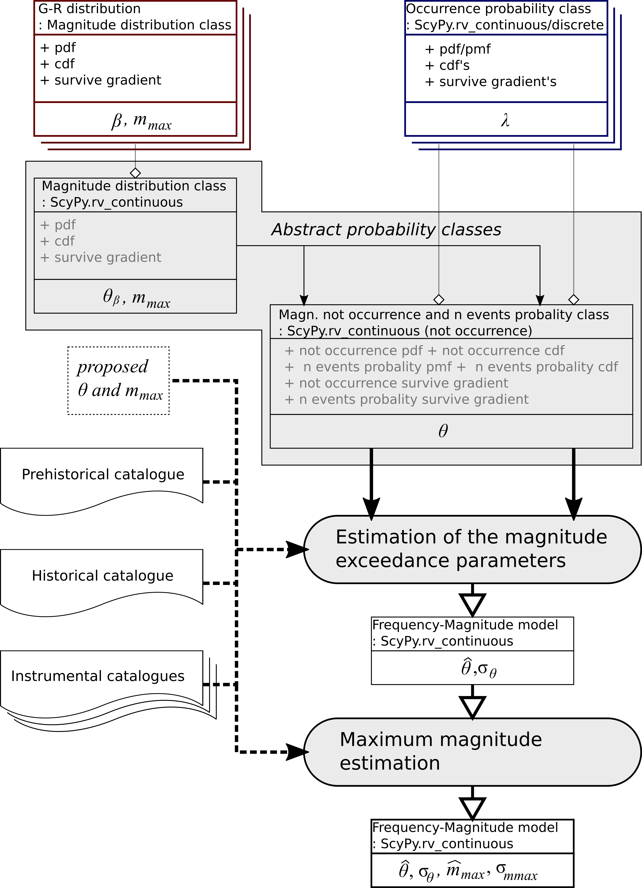

.. _operation:

#################
Operation diagram
#################

Overview
########

The presented programme is a development of the written in Matlab language HA3 programme,
which realises a generic methodology that is capable of utilizing different sources of information
and uncertainty in the natural hazard based on the theory described
among others in a series of works entitled
"Estimation of Earthquake Hazard Parameters from Incomplete Data Files"
(cite:t:`Kijko_atal_2016`).
It applies to various types of natural hazards - prehistoric, historical, and instrumental
data can be incorporated and the programme can account for incomplete data,
uncertainty in event sizes, and applied occurrence distributions.
In addition, the inclusion of weighting information reflecting individual event validity is available.

.. _classes_rev:

Ha3Py classes
#############

The presented code is written in Python and realises an object-oriented approach to this issue.
The estimation algorithm works on abstract magnitude probability classes :numref:`(Fig. %s) <fig_o1>`.
It provides a very flexible structure,
allowing the assessment of multiple probability distributions in various combinations.

.. _fig_o1:

    The block diagram of magnitude recurrence parameters estimation.

You can define your classes of the studied probability,
which describes the probabilities of the :ref:`earthquake occurrence model <api_ed>`.
Additionally, assuming independence of magnitude of the seismic events of their occurrence,
we can simplify the probability by defining the :ref:`magnitude distribution <api_md>` class independent of the recurrence.
Because each probability class inherits from the SciPy Statistical Library,
you need only to define the probability density function or the cumulative distribution function.
Additionally, you must define the survival function's gradient to assess parameter estimation errors.

Some classes of probability models, like :ref:`Gutenberg-Richter <api_md>`
and :ref:`compound Poisson distribution <api_ed>`,
commonly used in seismic hazard probabilities, are predefined.
The are presented in :ref:`application modules <api_modules>`.

Estimation diagram
##################
The algorithm works on abstract probability classes :numref:`(Fig. %s) <fig_o1>`.
The following classes are required:

    * magnitude distribution class,
    * probability of not occurrence in a given time of the event with
      a magnitude greater than given one probability of occurrence in time a given number of events with
      a magnitude greater than the given one (one class supports two probabilities).
    * classes supporting the :math:`m_{max}` estimation

Some classes are predefined but user can define own classes performing
following required methods of probability distribution classes:

    * the probability density function (pdf)
      (probability mass function in case of discrete distribution - pmf)
    * or the cumulative distribution function (cdf),
    * the gradient of the survival function versus all probability parameters
      (:math:`\nabla S_M`),

In the case of probability of occurrence in time a given number of events additionally methods for
discrete probability are required.
Because the probability parameters can be other than lambda and beta, their names must be also defined.

The presented diagram describe all available by HyPy seismic hazard assessment computation task
but it is possible to perform individual task,
e.g. only maximum magnitude estimation under the condition all required parameters
were earlier estimated or set manually in the configuration.
