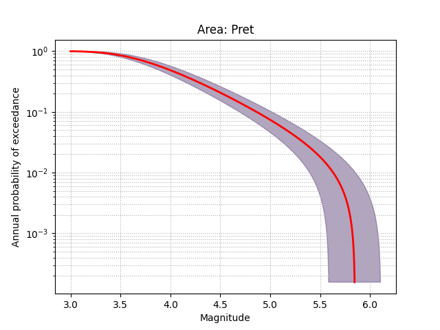
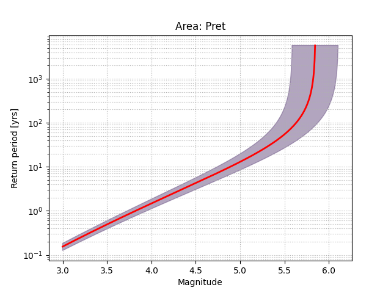
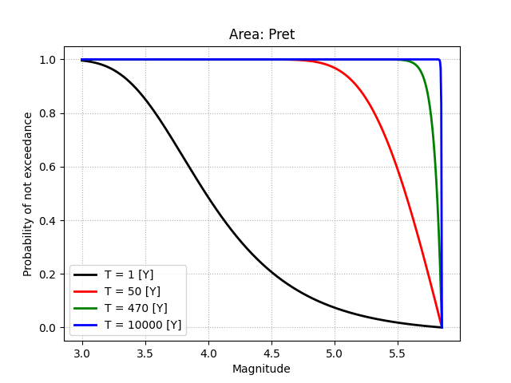

.. _running:

##################
Command line tools
##################

There are some Python programs that you can call from the console to compute seismic hazard parameters,
get and visualize the results, or simulate catalogs.
WARNING. It is important to have defined the Pythin scripts catalog in the system paths environment.

Main program for assessment of seismic hazard parameters
========================================================

Main program for assessment of seismic hazard parameters is `ha3`.
It works similar to the program `HA3` written HA3 by A. Kijko in Matlab,
which means that it asks the user similar questions and generates the same results.

The `ha3` programs uses the following modules,
which can be also used as standalone programs:

1. From the `configuration` module, the ha3 calls the procedure `questions`
    that sent question to the user and generate the parameter structure
    required to seismic hazard estimation.
    In order to operate, see the :ref:`Configuration of the Ha3Py` section.
2. From the `compute` module, the ha3 calls the procedure `compute`
    that estimate the SH based on parameters earlier defined.
    The results are added to the parameter structure.
    In order to operate, see the :ref:`Compute the earthquake hazard parameters` section.
3. Results are printed on console or to file by procedures in the `print_info`
    and `print_results` module (see :ref:`Printing the estimation results`).
4. Figures of results are plotted by the `plot_results` module,
    which consist of procedure tah allows plot diagrams of SH properties
    (see :ref:`Plotting the estimation results`).

All presented modules can be call independently.
We want to point out that the similarity of `ha3` to Matlab `HA3` results in
the impossibility of all new Ha3Py options definitions.
If we want to use them, we should not call `ha3` but:
define the configuration file differently, e.g. by calling `ha_config`
(see the :ref:`Configuration of the Ha3Py` section),
modifying the configuration file
(see the :ref:`Configuration description <configuration>` section),
and finally calling `ha_compute`.

**Calling** ::

    ha3 [ <configuration_file.json> ]

where <configuration_file.json> is the optional input configuration file name.
If configuration_file.json exists the program fills only missing
entries in the configuration dictionary, there will then appear the message ::

    ==============================================================
    Loading configuration file for '<area_name>'
    ==============================================================

when <area_name> is defined in the configuration file or ::

    ==============================================================
    Loading configuration file for undefined area
    ==============================================================

If configuration_file.json does not exist, there will then appear the message ::

    ==============================================================
    The configuration will be created from the beginning
    ==============================================================

If configuration_file.json is wrong or empty, there will then appear the message ::

    ==============================================================
    The configuration file error: *reason for file not being read if exist*
    The configuration will be created from the beginning
    ==============================================================

and configuration starts from the beginning.

Next, the list of questions appears for the user to answer.
The  full series of queries appears
when the input file name is not defined in the configuration.
If configuration_file.json exists,
the program does not ask for most positions defined in the configuration.
The first question is ::

    Name of your output file >

The output file is the text file file name
that the seismic hazard values and estimation info are saved.
The extension 'txt' is added to the file name as default. ::

    Name of the output configuration file >

This file contains the configuration with all the choices made in the program.
The output configuration file can be used as input configuration file in other Ha3Py programs.
The output configuration file will be in the `JSON`_ format.
Therefore, It is recommended that the file name have extension `json`.
If extension is missing, the default 'json' is added to the file name. ::

    Name of the area >

Name of the area that you are investigating. The name will appear in reports and results files
The query appears when the area name is not defined in the configuration. ::

    Pre-historic (paleo) data file name or enter if none >

The name of a prehistoric (paleo-) catalogue file if it is available.
The query appears when the paleo-catalogue is not defined in the configuration.
Putting ENTER indicates not processing a paleo-catalogue.
The format of paleo-catalogue file is similar to the Matlab HA3 formats.
It described in :ref:`Input/Output data section <io_data>`.
Events with magnitude below the completeness leve must be removed. ::

    Historic data file name or enter if none >

The name of a historical catalogue file if it is available.
The query appears when the historical catalogue was not earlier defined in the configuration.
Putting ENTER indicates not processing a historical catalogue.
The format of historical catalogue file is similar to the Matlab HA3 formats.
It described in :ref:`Input/Output data section <io_data>`.
Events with magnitude below the completeness leve must be removed. ::

    Number of complete data catalogue files >

Indicate the number of complete catalogues.
The query appears when complete catalogues were not earlier defined in the configuration.
When the number greater than zero was put,
the following equation appears the number of catalogues times. ::

    Name of the #<i> file with complete data >

The name of the <i>-th complete catalogue file.
Putting ENTER is not allowed in this case.
The format of complete catalogue file is described in :ref:`Input/Output data section <io_data>`.
The catalogue must be declustered end events with magnitude below the completeness leve must be removed. ::

    Maximum (EVER!) observed magnitude determination less or equal to *m.m* (or enter to confirm *m.m*) >

    Maximum (EVER!) observed magnitude determination >

This value refers to the maximum observed magnitude.
It is preset over all the provided catalogues and the maximum magnitude *m.m* is found.
However, the higher value can be set based on other information.
If not set (second quarry), it must be defined.
The program always asks for the maximum observed magnitude.::

    Standard deviation of the maximum observed magnitude (or enter to confirm *e*) >

    Standard deviation of the maximum observed magnitude >

The standard deviation value refers to the maximum observed magnitude.
If it is preset from catalogues, it is proposed as *e*.
However, the other value can be set based on other information.
If not set (second quarry), it must be defined. The program always asks for the standard deviation value. ::

    Minimum value of magnitude  less or equal to *m.m* (or enter to confirm *m.m*)

The minimum value of magnitude refers to the minimum (completness) magnitude
of catalogues. It is proposed es the smallest completeness magnitude *m.m* of all catalogues.
However, the other higher than *m.m* value can be set.
The program always asks for minimum completeness magnitude::

    Year when time span starts less or equal to *yyyy* (or enter to confirm it) >

The beginning of the whole time span,
if it is to be earlier than the first earthquake time (*yyyy*). ::

    Time interval #1 = 1 year by default. You do not need define thr first time interval
    Time interval #1 >
    Time interval #2 >
    Time interval #3 >

Time intervals for which seismic hazard will be estimated.
Actually, four time intervals are used.
The time interval of 1 year is given automatically. Others are here defined here
in units of years. Suggested times** 50, 100 and 1000. ::

    Assessment of the maximum regional magnitude m_max is based on:
     1: 'Gibowicz-Kijko (1994)',
     2: 'Gibowicz-Kijko-Bayes (Kijko and Singh, 2011)',
     3: 'Kijko-Sellevoll (1989)',
     4: 'Kijko-Sellevoll-Bayes/compound (Kijko, 2004)',
     5: 'Tate-Pisarenko (Kijko and Graham, 1998)',
     6: 'Tate-Pisarenko-Bayes/compound (Kijko and Singh, 2011)',
     7: 'Non-Parametric-Gaussian/pseudo (Kijko, 2004)',
     8: 'Bayesian MEAN of shifted Likelihood Function & Gaussian Prior (Kijko, 2012)',
     9: 'Bayesian MEAN of Posterior Fiduicial & Prior Gauss (Kijko, 2004)'
    Write proper number >

or ::

    Assessment of the maximum regional magnitude m_max is based on:
     1: 'Gibowicz-Kijko (1994)',
     2: 'Gibowicz-Kijko-Bayes (Kijko and Singh, 2011)',
     3: 'Kijko-Sellevoll (1989)',
     4: 'Kijko-Sellevoll-Bayes/compound (Kijko, 2004)',
     5: 'Tate-Pisarenko (Kijko and Graham, 1998)',
     6: 'Tate-Pisarenko-Bayes/compound (Kijko and Singh, 2011)',
     7: 'Non-Parametric-Gaussian/pseudo (Kijko, 2004)',
     8: 'Bayesian MEAN of shifted Likelihood Function & Gaussian Prior (Kijko, 2012)',
     9: 'Bayesian MEAN of Posterior Fiduicial & Prior Gauss (Kijko, 2004)'
    Write proper number (or enter to confirm *n*) >

when the the the maximum regional magnitude assessment is already defined.
Any one of these 9 procedures can be defined to calculate :math:`m_{max}`.
Based on the selected number the maximum magnitude procedure is defined.
Additionally, occurrence provability, magnitude distribution, delta computation method
are also defined.
The Kijko-Sellevoll-Bayes (4) procedure is recommended.
The selected method to not agree with the described predefined
:ref:`maximum magnitude assessment methods <description_m_max>` described in
:ref:`the theoretical background <description>`, because it is a copy
of the list of choices from the **HA3** program in Matlab.
The selection made is translated to definitions of 'm_max_assessment', 'delta'
'occurrence_probability', and 'magnitude_distribution'
(see :ref:`configuration`)

Then the complete analysis will be based on compound distribution principles.
(If Bayesian maximum magnitude is not chosen the question does not appear) ::

    Prior value of maximum possible earthquake magnitude (not less than *m.m*) >

The prior maximum regional magnitude :math:`m_{max}` value for Bayesian :math:`m_{max}` assessment methods.
(If Bayesian maximum magnitude is not chosen the question does not appear)::

    Standard deviation of of prior m_max value >

The prior maximum regional magnitude :math:`\sigma_{m_{max}}` for Bayesian :math:`m_{max}` assessment methods.
If magnitude distribution is the Compound Gutenberg-Richter the program asks for :the math:`q_{beta}` value: ::

    Define the Gutenberg-Richter parameter b uncertainty in percents (or enter for 25.0)  [%] >

If the events occurrence follows the Gamma Compound Poisson distribution,
the program asks for :the math:`q_{\lambda}` value: ::

    Define the mean activity rate 'lambda' uncertainty in percents (or enter for 25.0)  [%] >

In the case if Non-Parametric-Gaussian the program asks for number of largest magnitudes limit  ::

    Number of largest magnitudes (or enter for all) >

Calculation the seismic hazard from all magnitudes can be significantly time consuming.

Next remaining parameters are defined. ::

    Is provision for induced seismicity required (yes/no)? >

Induced seismicity here refers to water or dam induced seismicity.
If a provision is not required, enter *no*.
If a provision is required and must be included in the hazard assessment enter *yes*.
Then the user will be asked to provide the multiplicative factor for :math:`\lambda`. ::

    Multiplicative factor of activity rate (lambda) >

The answer is the value of multiplicative factor for :math:`\lambda`
Induced seismicity usually don’t exceed the tectonic origin seismicity.
Therefore the multiplicative factor for the :math:`\lambda` is usually not more than 2. ::

    Prior value of the Gutenberg-Richter parameter b (enter if not defined) >

The prior b-value of the Gutenberg-Richter distribution for Bayesian magnitude occurrence estimation methods.
If you define the prior b-value, the next question is::

    Standard deviation of the prior b value of >

Additional information for the b-parameter is valuable.
It will help to stabilize the results in the case of poor quality catalogues.
Information from similar tectonic areas can be used. ::

    Choose optimization method (see scipy.optimize) >

Choosing the optimization method for ln_likelihood maximization.
The following method names can be used (see `scipy.optimize`_)

* Nelder-Mead
* Powell
* CG
* BFGS
* Newton-CG
* L-BFGS-B
* TNC
* COBYLA
* COBYQA
* SLSQP
* dogleg
* trust-ncg

At the end, the configuration program ha3 asks, whether to save the configuration to other JSON file
before starting seismic hazard estimation. ::

    File to save the only configuration [enter if not save] >

It is useful, if you plan do estimation many times. Next the the program starts computations.
The :math:`m_{max}` is assessed with the cooperation with the user.
Other seismic hazard parameters are estimated by the maximum likelihood method.
There can be many iteration of :math:`m_{max}` assessment,
which are notified by the message e.g. ::

    Likelihood estimation result: Optimization terminated successfully.
    ==================================================================
    Run round number #1
    ------------------------------------------------------------------
    lambda     =  6.295 (for m_min = 3.00)
    beta       =  2.451 (b = 1.1)
    m_max (current) = 6.3
    Suggested value of m_max = 5.862 (sd_m_max = 0.260)
                               for m_max_obs = 5.80
    ==================================================================

The estimated coefficients list depends on the magnitude occurrence model.
Here are beta and lambda.
The the the information of result is shown. Message::

    You have reach an optimal solution !!!

means that there an optimal solution was reached and repeating calculation is not recommended.
Otherwise a message::

    To obtain the optimal solution for m_max, please re-run the process
    according to the suggested value until the SUGGESTED and SOLUTION
    values are the same.

will be displayed. Then the program asks en operator to set
the current maximum magnitude based on showed information's::

    NEW value of m_max (NOT LESS than 5.80) (or enter to accept current 6.30 and finish) >

Pressing ENTER accepts the maximum magnitude and finishes assessment.
Putting a new current magnitude value starts next estimation round.
Next the program asses the estimation uncertainty, and calculates the hazard values.
Results are saved to the output file as a text, saved with the configuration to the JSON file,
and printed on screen, e.g. ::

    ==================================================================
    Information provided by each part of catalogue (in per-cent)
    ------------------------------------------------------------------
    Historic catalogue:     lambda = 51.7%
                            beta   = 22.2%
    Complete catalogue(s):  lambda = 48.3%
                            beta   = 77.8%
    ==================================================================
    Final results
    ------------------------------------------------------------------
    Area: Pret
    Created on 2025-05-05 18:55:15
    Computed on 2025-05-05 19:11:03
    ------------------------------------------------------------------
    lambda     =   6.476 +/- 1.204, (for m_min = 3.00)
        LAMBDA(IS) = 6.476 +/-1.204
    beta       =   2.388 +/- 0.108, (b = 1.04 +/- 0.05)
    m_max      =   5.850 +/- 0.260
    ------------------------------------------------------------------
    COV = [    1.449   -0.048 ]
          [   -0.048    0.012 ]
    Corr(lambda,beta) = -0.368
    =================================================================================
    |                                SEISMIC HAZARD                                 |
    =================================================================================
    | Mag  |Lambda(sf)|   RP    | pr. T=    1| pr. T=   50| pr. T=  470| pr. T=10000|
    |------|----------|---------|------------|------------|------------|------------|
    | 3.00 | 6.48e+00 |     0.2 |  0.995650  |  1.000000  |  1.000000  |  1.000000  |
    | 3.10 | 5.10e+00 |     0.2 |  0.988087  |  1.000000  |  1.000000  |  1.000000  |
    | 3.20 | 4.04e+00 |     0.2 |  0.972655  |  1.000000  |  1.000000  |  1.000000  |
    | 3.30 | 3.20e+00 |     0.3 |  0.945979  |  1.000000  |  1.000000  |  1.000000  |
    | 3.40 | 2.55e+00 |     0.4 |  0.905898  |  1.000000  |  1.000000  |  1.000000  |
    | 3.50 | 2.03e+00 |     0.5 |  0.852307  |  1.000000  |  1.000000  |  1.000000  |
    | 3.60 | 1.62e+00 |     0.6 |  0.787223  |  1.000000  |  1.000000  |  1.000000  |
    | 3.70 | 1.30e+00 |     0.8 |  0.714138  |  1.000000  |  1.000000  |  1.000000  |
    | 3.80 | 1.05e+00 |     1.0 |  0.637110  |  1.000000  |  1.000000  |  1.000000  |
    | 3.90 | 8.42e-01 |     1.2 |  0.559961  |  1.000000  |  1.000000  |  1.000000  |
    | 4.00 | 6.79e-01 |     1.5 |  0.485773  |  1.000000  |  1.000000  |  1.000000  |
    | 4.10 | 5.48e-01 |     1.8 |  0.416703  |  1.000000  |  1.000000  |  1.000000  |
    | 4.20 | 4.43e-01 |     2.3 |  0.354023  |  0.999999  |  1.000000  |  1.000000  |
    | 4.30 | 3.58e-01 |     2.8 |  0.298276  |  0.999994  |  1.000000  |  1.000000  |
    | 4.40 | 2.90e-01 |     3.5 |  0.249471  |  0.999967  |  1.000000  |  1.000000  |
    | 4.50 | 2.34e-01 |     4.3 |  0.207263  |  0.999846  |  1.000000  |  1.000000  |
    | 4.60 | 1.89e-01 |     5.3 |  0.171103  |  0.999400  |  1.000000  |  1.000000  |
    | 4.70 | 1.52e-01 |     6.6 |  0.140347  |  0.998004  |  1.000000  |  1.000000  |
    | 4.80 | 1.22e-01 |     8.2 |  0.114328  |  0.994276  |  1.000000  |  1.000000  |
    | 4.90 | 9.73e-02 |    10.3 |  0.092405  |  0.985677  |  1.000000  |  1.000000  |
    | 5.00 | 7.70e-02 |    13.0 |  0.073984  |  0.968311  |  1.000000  |  1.000000  |
    | 5.10 | 6.04e-02 |    16.5 |  0.058536  |  0.937201  |  1.000000  |  1.000000  |
    | 5.20 | 4.67e-02 |    21.4 |  0.045596  |  0.887090  |  0.999999  |  1.000000  |
    | 5.30 | 3.54e-02 |    28.2 |  0.034765  |  0.813586  |  0.999989  |  1.000000  |
    | 5.40 | 2.61e-02 |    38.4 |  0.025699  |  0.714211  |  0.999888  |  1.000000  |
    | 5.50 | 1.83e-02 |    54.7 |  0.018110  |  0.589005  |  0.998971  |  1.000000  |
    | 5.60 | 1.18e-02 |    84.5 |  0.011754  |  0.440523  |  0.991533  |  1.000000  |
    | 5.70 | 6.45e-03 |   155.1 |  0.006427  |  0.273309  |  0.937700  |  1.000000  |
    | 5.80 | 1.96e-03 |   510.2 |  0.001958  |  0.093087  |  0.591688  |  0.999997  |
    =================================================================================

Finally program plots the seismic hazard figures:

    * Annual probability of exceedance versus magnitude
    * Return period versus magnitude
    * Probability of not exceedance for four defined time intervals

**Closing the drawings ends the program.**

The figures are also written to png files: `annual_probability.png`, `return_period.png`,
and `probabilities.png`.

Maximum possible earthquake magnitude computation
=================================================

The maximum magnitude is estimated independently of other magnitude recurrence parameters.
Users can use one from the list of predefined magnitude estimation algorithms.
The presented software evaluates the probability of exceedance of a specified magnitude
based on all presented catalogues if we have them.
We can also apply it only to the historical or instrumental catalogue itself.

Of course, one must be reasonable, especially during the maximum magnitude estimation.
(**The used must remember the principle, “*no mathematical tricks can replace the data*”.**)

The software's adaptability is a key feature,
as it can estimate any probability distribution of exceedance of a magnitude.
This can be further divided into two probability distributions:
the occurrence of an earthquake in time distribution and magnitude distribution.
Importantly, there are no other prior assumptions about the probability function,
showcasing the software's adaptability.

**Calling** ::

    ha_m_max <configuration_file.json>

Unlike the 'ha3' program,
the maximum possible earthquake magnitude estimation requires full configuration
in the <configuration_file.json> JSON file.
You can use for that the configuration program (see bellow),
although not all available magnitude estimation methods can be there define.
The magnitude estimation requires requires in the configuration
the method definition maximum observed magnitude,
and their uncertainty.
Depending on the method, it requires additionally the description of
event occurrence and magnitude distribution,
delta calculation method, time span, catalogues, etc.
It must be checked in the earthquake magnitude estimation description.

In contrast to the `ha3` and `compute` programs the `compute_m_max` processes
only one round of :math:`m_{max}` estimation, prints the result, e.g. ::

    Result of m_max estimation: m_max = 7.32 (+/- 0.65)

and asks ::

    Save the result? [yes/no] >

User has to put *yes* to save the results of :math:`m_{max}` estimation.
The results are saved to the output configuration JSON file.
If the output name is not defined in the configuration, the output file name is 'Ha3Py.json'.

Configuration of the Ha3Py
==========================

**Calling** ::

    ha_config [ <configuration_file.json> ]

where <configuration_file.json> is the optional input configuration file name.
If configuration_file.json exists the configuration program fills only missing
entries in the configuration dictionary, there will then appear the message::

    ==============================================================
    Loading configuration file for '<area_name>'
    ==============================================================

when <area_name> is defined in the configuration file or ::

    ==============================================================
    Loading configuration file for undefined area
    ==============================================================

If configuration_file.json does not exist, there will then appear the message ::

    ==============================================================
    The configuration will be created from the beginning
    ==============================================================

If configuration_file.json is wrong or empty, there will then appear the message ::

    ==============================================================
    The configuration file error: *reason for file not being read if exist*
    The configuration will be created from the beginning
    ==============================================================

Then the list of questions appears for the user to answer.
The  full series of queries appears
when the input file name is not defined in the configuration.
If configuration_file.json exists,
the program does not ask for most positions defined in the configuration.
The first question is ::

    Name of your output file >

The output file is the text file file name
that the seismic hazard values and estimation info are saved.
The extension 'txt' is added to the file name as default. ::

    Name of the output configuration file >

This file contains the configuration with all the choices made in the program.
The output configuration file can be used as input configuration file in other Ha3Py programs.
The output configuration file will be in the `JSON`_ format.
Therefore, It is recommended that the file name have extension `json`.
If extension is missing, the default 'json' is added to the file name. ::

    Name of the area >

Name of the area that you are investigating. The name will appear in reports and results files
The query appears when the area name is not defined in the configuration. ::

    Pre-historic (paleo) data file name or enter if none >

The name of a prehistoric (paleo-) catalogue file if it is available.
The query appears when the paleo-catalogue is not defined in the configuration.
Putting ENTER indicates not processing a paleo-catalogue.
The format of paleo-catalogue file is similar to the Matlab HA3 formats.
It described in :ref:`Input/Output data section <io_data>`.
Events with magnitude below the completeness leve must be removed. ::

    Historic data file name or enter if none >

The name of a historical catalogue file if it is available.
The query appears when the historical catalogue was not earlier defined in the configuration.
Putting ENTER indicates not processing a historical catalogue.
The format of historical catalogue file is similar to the Matlab HA3 formats.
It described in :ref:`Input/Output data section <io_data>`.
Events with magnitude below the completeness leve must be removed. ::

    Number of complete data catalogue files >

Indicate the number of complete catalogues.
The query appears when complete catalogues were not earlier defined in the configuration.
When the number greater than zero was put,
the following equation appears the number of catalogues times. ::

    Name of the #<i> file with complete data >

The name of the <i>-th complete catalogue file.
Putting ENTER is not allowed in this case.
The format of complete catalogue file is described in :ref:`Input/Output data section <io_data>`.
The catalogue must be declustered end events with magnitude below the completeness leve must be removed. ::

    Maximum (EVER!) observed magnitude determination less or equal to *m.m* (or enter to confirm *m.m*) >

    Maximum (EVER!) observed magnitude determination >

This value refers to the maximum observed magnitude.
It is preset over all the provided catalogues and the maximum magnitude *m.m* is found.
However, the higher value can be set based on other information.
If not set (second quarry), it must be defined.
The program always asks for the maximum observed magnitude.::

    Standard deviation of the maximum observed magnitude (or enter to confirm *e*) >

    Standard deviation of the maximum observed magnitude >

The standard deviation value refers to the maximum observed magnitude.
If it is preset from catalogues, it is proposed as *e*.
However, the other value can be set based on other information.
If not set (second quarry), it must be defined. The program always asks for the standard deviation value. ::

    Minimum value of magnitude  less or equal to *m.m* (or enter to confirm *m.m*)

The minimum value of magnitude refers to the minimum (completness) magnitude
of catalogues. It is proposed es the smallest completeness magnitude *m.m* of all catalogues.
However, the other higher than *m.m* value can be set.
The program always asks for minimum completeness magnitude::

    Year when time span starts less or equal to *yyyy* (or enter to confirm it) >

The beginning of the whole time span,
if it is to be earlier than the first earthquake time (*yyyy*). ::

    Time interval #1 = 1 year by default. You do not need define thr first time interval
    Time interval #1 >
    Time interval #2 >
    Time interval #3 >

Time intervals for which seismic hazard will be estimated.
Actually, four time intervals are used.
The time interval of 1 year is given automatically. Others are here defined here
in units of years. Suggested times** 50, 100 and 1000. ::

    Assessment of the maximum regional magnitude m_max is based on:
     1: 'Gibowicz-Kijko (1994)',
     2: 'Gibowicz-Kijko-Bayes (Kijko and Singh, 2011)',
     3: 'Kijko-Sellevoll (1989)',
     4: 'Kijko-Sellevoll-Bayes/compound (Kijko, 2004)',
     5: 'Tate-Pisarenko (Kijko and Graham, 1998)',
     6: 'Tate-Pisarenko-Bayes/compound (Kijko and Singh, 2011)',
     7: 'Non-Parametric-Gaussian/pseudo (Kijko, 2004)',
     8: 'Bayesian MEAN of shifted Likelihood Function & Gaussian Prior (Kijko, 2012)',
     9: 'Bayesian MEAN of Posterior Fiduicial & Prior Gauss (Kijko, 2004)'
    Write proper number >

or ::

    Assessment of the maximum regional magnitude m_max is based on:
     1: 'Gibowicz-Kijko (1994)',
     2: 'Gibowicz-Kijko-Bayes (Kijko and Singh, 2011)',
     3: 'Kijko-Sellevoll (1989)',
     4: 'Kijko-Sellevoll-Bayes/compound (Kijko, 2004)',
     5: 'Tate-Pisarenko (Kijko and Graham, 1998)',
     6: 'Tate-Pisarenko-Bayes/compound (Kijko and Singh, 2011)',
     7: 'Non-Parametric-Gaussian/pseudo (Kijko, 2004)',
     8: 'Bayesian MEAN of shifted Likelihood Function & Gaussian Prior (Kijko, 2012)',
     9: 'Bayesian MEAN of Posterior Fiduicial & Prior Gauss (Kijko, 2004)'
    Write proper number (or enter to confirm *n*) >

when the the the maximum regional magnitude assessment is already defined.
Any one of these 9 procedures can be defined to calculate :math:`m_{max}`.
Based on the selected number the maximum magnitude procedure is defined.
Additionally, occurrence provability, magnitude distribution, delta computation method
are also defined.
The Kijko-Sellevoll-Bayes (4) procedure is recommended.
The selected method to not agree with the described predefined
:ref:`maximum magnitude assessment methods <description_m_max>` described in
:ref:`the theoretical background <description>`, because it is a copy
of the list of choices from the **HA3** program in Matlab.
The selection made is translated to definitions of 'm_max_assessment', 'delta'
'occurrence_probability', and 'magnitude_distribution'
(see :ref:`configuration`)

Then the complete analysis will be based on compound distribution principles.
(If Bayesian maximum magnitude is not chosen the question does not appear) ::

    Prior value of maximum possible earthquake magnitude (not less than *m.m*) >

The prior maximum regional magnitude :math:`m_{max}` value for Bayesian :math:`m_{max}` assessment methods.
(If Bayesian maximum magnitude is not chosen the question does not appear)::

    Standard deviation of of prior m_max value >

The prior maximum regional magnitude :math:`\sigma_{m_{max}}` for Bayesian :math:`m_{max}` assessment methods.
If magnitude distribution is the Compound Gutenberg-Richter the program asks for :the math:`q_{beta}` value: ::

    Define the Gutenberg-Richter parameter b uncertainty in percents (or enter for 25.0)  [%] >

If the events occurrence follows the Gamma Compound Poisson distribution,
the program asks for :the math:`q_{\lambda}` value: ::

    Define the mean activity rate 'lambda' uncertainty in percents (or enter for 25.0)  [%] >

In the case if Non-Parametric-Gaussian the program asks for number of largest magnitudes limit  ::

    Number of largest magnitudes (or enter for all) >

Calculation the seismic hazard from all magnitudes can be significantly time consuming.

Next remaining parameters are defined. ::

    Is provision for induced seismicity required (yes/no)? >

Induced seismicity here refers to water or dam induced seismicity.
If a provision is not required, enter *no*.
If a provision is required and must be included in the hazard assessment enter *yes*.
Then the user will be asked to provide the multiplicative factor for :math:`\lambda`. ::

    Multiplicative factor of activity rate (lambda) >

The answer is the value of multiplicative factor for :math:`\lambda`
Induced seismicity usually don’t exceed the tectonic origin seismicity.
Therefore the multiplicative factor for the :math:`\lambda` is usually not more than 2. ::

    Prior value of the Gutenberg-Richter parameter b (enter if not defined) >

The prior b-value of the Gutenberg-Richter distribution for Bayesian magnitude occurrence estimation methods.
If you define the prior b-value, the next question is::

    Standard deviation of the prior b value of >

Additional information for the b-parameter is valuable.
It will help to stabilize the results in the case of poor quality catalogues.
Information from similar tectonic areas can be used. ::

    Choose optimization method (see scipy.optimize) >

Choosing the optimization method for ln_likelihood maximization.
The following method names can be used (see `scipy.optimize`_)

* Nelder-Mead
* Powell
* CG
* BFGS
* Newton-CG
* L-BFGS-B
* TNC
* COBYLA
* COBYQA
* SLSQP
* dogleg
* trust-ncg

At the end the configuration is saved to the output JSON file.
It is done only when something was changed in the configuration.

Import catalogue to Ha3Py
=========================

The program imports catalogues in other formats do the configuration file

**Calling** ::

    ha_import <configuration_file.json> <imported_catalogue> <format_name>

The program imports catalogues <imported_catalogue.extension> in all `ObsPy formats`_ and
in MATLAB file from `EPISODES Platform`_ (<format_name> is 'EPISODES').
The <configuration_file.json> must exist created manually or by the *configuration* program.
Already defined in the <configuration_file.json> prehistorical and historical catalogs remain unchanged.
Complete catalog can be remove or remain depends of the operator decision.
Program list existing complete catalogs, e.g, ::

    There exists 2 complete catalogs:
     1: c1.txt
     2. c2.txt
    Write number of name of the catalog to remove it or ENTER to skip >

and the user can remove the catalogue by writing its number (e.g. 1 or 2) or its name (e.g. c1.txt or c2.txt)
ENTER ends catalogues removing and the new catalogue will be added to remaining catalogues.
Catalogues need not contain magnitude uncertainties.
Therefore user must define the default value ::

    Default standard deviation of magnitude >

which be added to the event in the case of missing magnitude uncertainty. The catalogue must be declustered end events with magnitude below the completeness magnitude
must be estimated using other tool. Because catalog do not contain the completeness magnitude
after the quation ::

    Minimum magnitude >

user must write the completeness magnitude value. All events in the catalogue having smaller magnitude
wil be ignored.

**WARNING** Program loads only earthquakes having magnitude Mw.

The modified configuration is saved to the output configuration file.
If the output name is not defined in the configuration, the output file name is 'Ha3Py.json'.

Compute the earthquake hazard parameters
========================================

**Calling** ::

    ha_compute <configuration_file.json>

The procedure estimates the magnitude occurrence probability,
including magnitude distribution, coefficients
(e.g. estimates :math:`\lambda` and :math:`\beta`)
and asses maximum possible event magnitude :math:`m_{max}` in the investigated area.
The assessment method depends on the configuration.
Results are saved to the output configuration file.
The existing in the configuration coefficients are replaced.

The :math:`m_{max}` is assessed with the cooperation with the user.
There can be many iteration of :math:`m_{max}` assessment,
which are notified by the message e.g. ::

    Likelihood estimation result: Optimization terminated successfully.
    ==================================================================
    Run round number #1
    ------------------------------------------------------------------
    lambda     =  6.295 (for m_min = 3.00)
    beta       =  2.451 (b = 1.1)
    m_max (current) = 6.3
    Suggested value of m_max = 5.862 (sd_m_max = 0.260)
                               for m_max_obs = 5.80
    ==================================================================

The estimated coefficients list depends on the magnitude occurrence model.
Here are beta and lambda.
The the the information of result is shown. Message::

    You have reach an optimal solution !!!

means that there an optimal solution was reached and repeating calculation is not recommended.
Otherwise a message::

    To obtain the optimal solution for m_max, please re-run the process
    according to the suggested value until the SUGGESTED and SOLUTION
    values are the same.

will be displayed. Then the program asks en operator to set
the current maximum magnitude based on showed information's::

    NEW value of m_max (NOT LESS than 5.80) (or enter to accept current 6.30 and finish) >

Pressing ENTER finishes assessment. Putting a magnitude value starts next estimation round.
The results are saved to the output configuration JSON file.
If the output name is not defined in the configuration, the output file name is 'Ha3Py.json'.

Printing the estimation results
===============================

The magnitude occurrence model estimation results can be printer to screen or to file.

**Calling** ::

    ha_print <configuration_file.json>

Program calculates and print the hazard values.
Results are saved to the output file as a text, saved with the configuration to the JSON file,
and printed on screen, e.g. ::

    ==================================================================
    Information provided by each part of catalogue (in per-cent)
    ------------------------------------------------------------------
    Historic catalogue:     lambda = 51.7%
                            beta   = 22.2%
    Complete catalogue(s):  lambda = 48.3%
                            beta   = 77.8%
    ==================================================================
    Final results
    ------------------------------------------------------------------
    Area: Pret
    Created on 2025-05-05 18:55:15
    Computed on 2025-05-05 19:11:03
    ------------------------------------------------------------------
    lambda     =   6.476 +/- 1.204, (for m_min = 3.00)
        LAMBDA(IS) = 6.476 +/-1.204
    beta       =   2.388 +/- 0.108, (b = 1.04 +/- 0.05)
    m_max      =   5.850 +/- 0.260
    ------------------------------------------------------------------
    COV = [    1.449   -0.048 ]
          [   -0.048    0.012 ]
    Corr(lambda,beta) = -0.368
    =================================================================================
    |                                SEISMIC HAZARD                                 |
    =================================================================================
    | Mag  |Lambda(sf)|   RP    | pr. T=    1| pr. T=   50| pr. T=  470| pr. T=10000|
    |------|----------|---------|------------|------------|------------|------------|
    | 3.00 | 6.48e+00 |     0.2 |  0.995650  |  1.000000  |  1.000000  |  1.000000  |
    | 3.10 | 5.10e+00 |     0.2 |  0.988087  |  1.000000  |  1.000000  |  1.000000  |
    | 3.20 | 4.04e+00 |     0.2 |  0.972655  |  1.000000  |  1.000000  |  1.000000  |
    | 3.30 | 3.20e+00 |     0.3 |  0.945979  |  1.000000  |  1.000000  |  1.000000  |
    | 3.40 | 2.55e+00 |     0.4 |  0.905898  |  1.000000  |  1.000000  |  1.000000  |
    | 3.50 | 2.03e+00 |     0.5 |  0.852307  |  1.000000  |  1.000000  |  1.000000  |
    | 3.60 | 1.62e+00 |     0.6 |  0.787223  |  1.000000  |  1.000000  |  1.000000  |
    | 3.70 | 1.30e+00 |     0.8 |  0.714138  |  1.000000  |  1.000000  |  1.000000  |
    | 3.80 | 1.05e+00 |     1.0 |  0.637110  |  1.000000  |  1.000000  |  1.000000  |
    | 3.90 | 8.42e-01 |     1.2 |  0.559961  |  1.000000  |  1.000000  |  1.000000  |
    | 4.00 | 6.79e-01 |     1.5 |  0.485773  |  1.000000  |  1.000000  |  1.000000  |
    | 4.10 | 5.48e-01 |     1.8 |  0.416703  |  1.000000  |  1.000000  |  1.000000  |
    | 4.20 | 4.43e-01 |     2.3 |  0.354023  |  0.999999  |  1.000000  |  1.000000  |
    | 4.30 | 3.58e-01 |     2.8 |  0.298276  |  0.999994  |  1.000000  |  1.000000  |
    | 4.40 | 2.90e-01 |     3.5 |  0.249471  |  0.999967  |  1.000000  |  1.000000  |
    | 4.50 | 2.34e-01 |     4.3 |  0.207263  |  0.999846  |  1.000000  |  1.000000  |
    | 4.60 | 1.89e-01 |     5.3 |  0.171103  |  0.999400  |  1.000000  |  1.000000  |
    | 4.70 | 1.52e-01 |     6.6 |  0.140347  |  0.998004  |  1.000000  |  1.000000  |
    | 4.80 | 1.22e-01 |     8.2 |  0.114328  |  0.994276  |  1.000000  |  1.000000  |
    | 4.90 | 9.73e-02 |    10.3 |  0.092405  |  0.985677  |  1.000000  |  1.000000  |
    | 5.00 | 7.70e-02 |    13.0 |  0.073984  |  0.968311  |  1.000000  |  1.000000  |
    | 5.10 | 6.04e-02 |    16.5 |  0.058536  |  0.937201  |  1.000000  |  1.000000  |
    | 5.20 | 4.67e-02 |    21.4 |  0.045596  |  0.887090  |  0.999999  |  1.000000  |
    | 5.30 | 3.54e-02 |    28.2 |  0.034765  |  0.813586  |  0.999989  |  1.000000  |
    | 5.40 | 2.61e-02 |    38.4 |  0.025699  |  0.714211  |  0.999888  |  1.000000  |
    | 5.50 | 1.83e-02 |    54.7 |  0.018110  |  0.589005  |  0.998971  |  1.000000  |
    | 5.60 | 1.18e-02 |    84.5 |  0.011754  |  0.440523  |  0.991533  |  1.000000  |
    | 5.70 | 6.45e-03 |   155.1 |  0.006427  |  0.273309  |  0.937700  |  1.000000  |
    | 5.80 | 1.96e-03 |   510.2 |  0.001958  |  0.093087  |  0.591688  |  0.999997  |
    =================================================================================

Plotting the estimation results
===============================

**Calling** ::

    ha_plot <configuration_file.json>

The program plots the seismic hazard figures, e.g :numref:`Fig. %s <fig_r1>`, :numref:`Fig. %s <fig_r2>`, :numref:`Fig. %s <fig_r3>`.

.. _fig_r1:

    Annual probability of exceedance versus magnitude

.. _fig_r2:

    Return period versus magnitude

.. _fig_r3:

    Probability of not exceedance for four defined time intervals

Closing the drawings ends the program.
The figures are also written to png files: `annual_probability.png`, `return_period.png`,
and `probabilities.png`.

Creating synthetic catalogues
=============================

The program creates synthetic catalogues base on the existing catalogue description in the configuration file
and defined seismic hazard parameters.
The program does the opposite of calculating the parameters of exceeding the magnitude.
Based on these parameters it simulates catalogs.
Program requires for simulation catalogue periods (begin time and end time),
completeness magnitude, and magnitude uncertainty.

**Calling** ::

    ha_simulate <configuration_file.json>

**WARNING! Existing earthquake lists in catalogs are overwritten.**

.. File format links:
.. _JSON: https://www.json.org
.. _scipy.optimize: https://docs.scipy.org/doc/scipy/reference/optimize.html#module-scipy.optimize
.. _ObsPy formats: https://docs.obspy.org/packages/autogen/obspy.core.event.catalog.read_events.html#supported-formats
.. _EPISODES Platform: https://docs.cyfronet.pl/display/ISDOC/Catalog+-+description
